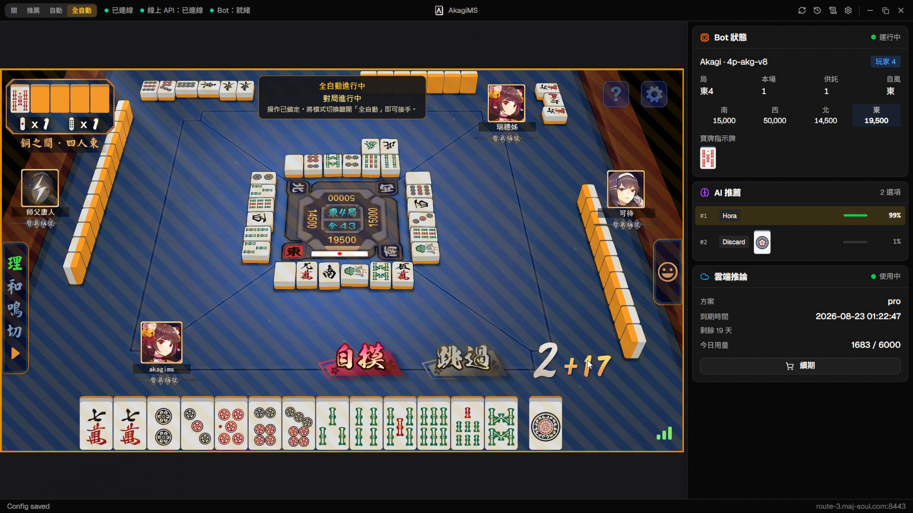

<!-- markdownlint-disable MD033 MD041 -->

 

  <picture>
    <source media="(prefers-color-scheme: dark)" srcset="assets/logo/akagi-logo-dark.png">
    
  </picture>

  <i>「死ねば助かるのに………」 - 赤木しげる</i>
    
  <b>AkagiMS</b> — 专为雀魂打造。 
  一个窗口：左边是游戏，右边是 AI 的判断。
    
  <a href="../../releases/latest"><b>下载</b></a>
  ·
  <a href="https://discord.gg/Z2wjXUK8bN">到 Discord 问任何问题</a>
  ·
  <a href="../../issues">反馈问题</a>

  
  
  

  <a href="./README.md">繁體中文</a>
  ·
  <b>简体中文</b>
  ·
  <a href="./README.en.md">English</a>

  <i>这个 repo 只发布程序，源代码不在这里。</i>

---

  

https://github.com/user-attachments/assets/d36bc5fb-898b-43fc-8867-97ab6ba2d193

---

## 下载

到 [**Releases**](../../releases/latest) 下载你的系统的压缩包，解压后运行里面的程序即可。

| | 文件 | 运行前要知道的事 |
|---|---|---|
| **Windows** | `akagims-<版本>-windows-x64.zip` | 运行 `akagi.exe`。 |
| **macOS** | `akagims-<版本>-macos-arm64.zip` | 运行 `./akagi`。仅限 Apple Silicon；程序未签名，第一次要先 `xattr -cr <解压出来的文件夹>`，或用右键 → 打开。 |
| **Linux** | `akagims-<版本>-linux-x64.zip` | 运行 `./akagi`。需要 WebKit2GTK 4.1——`apt install libwebkit2gtk-4.1-0` / `dnf install webkit2gtk4.1` / `pacman -S webkit2gtk-4.1`。 |

## 怎么用

在打开的窗口里登录雀魂，然后照常打。右边的面板会跟着牌局走。

左上角那四个按钮就是这个程序的全部：

| | |
|---|---|
| **关** | 什么都不做。 |
| **推荐** | 每个决策都排序列出，用牌面画给你看。牌还是你自己打。 |
| **自动** | 它替你点，用接近真人的节奏。 |
| **全自动** | 自己排段位战、打完、关掉结算画面、再排下一局。选好房间、赛制和局数就可以走人。 |

**全自动**进行中时，画面上会盖一层斜纹幕布接走你的点击，避免和它打架。
把模式切回去，幕布就会收起来。

---

AkagiMS 出自 [Akagi](https://github.com/shinkuan/Akagi)，后者支持更多平台，
也能加载你自己的 bot 模型。
